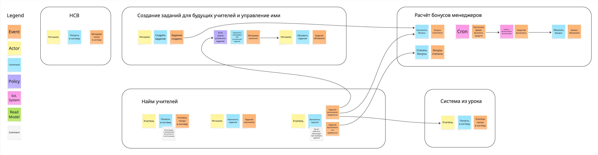

Домашняя работа N1
==================

Event storming
-----------------

[Ссылка на jpg](event-storming.jpg)

Коммуникация
------------

|Номер связи|Как связь сделана на текущий момент|Какая теперь будет связь|Номера проблем бизнеса, которые потенциально решатся|Почему связь необходимо изменить|
|-----------|--------------|-----------------|----------------------------|-----------------------|
|[COMM-010]|HTTP-вызов|асинхронное событие `ManagerUpdated`|Problem-080|увеличит отказоустойчивость и уменьшит связанность, к тому же менеджеры будут появляться редко, накладно их каждый раз запрашивать по API|
|[COMM-020]|HTTP-вызов|асинхронное событие `TaskCreated` и `TaskUpdated`|Problem-080|увеличит отказоустойчивость сервиса выполнения заданий|
|[COMM-030]|HTTP-вызов|асинхронное событие `TaskDone`|Problem-010,050,070,080,090,100|увеличит отказоустойчивость и уменьшит связанность|
|[COMM-040]|HTTP-вызов|асинхронное событие `TaskDone`|Problem-010,040,050,080,090,100|увеличит отказоустойчивость и уменьшит связанность|
|[COMM-050]|HTTP-вызов|асинхронное событие `TaskFailed`|Problem-010,040,050,070,080,090,100|увеличит отказоустойчивость и уменьшит связанность|
|[COMM-060]|асинхронное событие|убрать эту коммуникацию|Problem-030,090|рейтинг будет отправлен вместе с событием о выполнении задания, чтобы исключить гонку при начислении бонусов|
|[COMM-070]|HTTP-вызов|асинхронное событие `ManagerUpdated`|Problem-080|увеличит отказоустойчивость и уменьшит связанность, к тому же менеджеры будут появляться редко, накладно их каждый раз запрашивать по API|
|[COMM-080]|HTTP-вызов|асинхронное событие `TaskCreated`|Problem-080,090|увеличит отказоустойчивость сервиса управления заданиями, упавший сервис бонусов не повлияет на его работу|
|[COMM-090]|HTTP-вызов| связи не будет, назначение задания будет в сервисе найма учителей|Problem-090|если перенести назначение задания в сервис найма, то можно будет избавиться от этой коммуникации|

Информация о менеджерах нужна во всех сервисах системы и нужно как-то стримить эти данные.
Предполагаю, что эта информация будет меняться редко и допустим лаг по времени распространения информации.
Чтобы уменьшить связанность между сервисами и увеличить отказоустойчивость (Problem-080) эти данные будут
передаваться при помощи асинхронного события `ManagerUpdated`, которое будут слушать сервис найма и сервис бонусов.

Когда менеджер создает задание рассылается событие `TaskCreated`. Сервис найма в ответ на это событие сохраняет у себя
данные о новой задаче. Сервис бонусов начисляет бонусы за новую созданную задачу.

Когда менеджер обновляет задание, рассылается событие `TaskUpdated`. Сервис найма сохраняет данные обновлённой задачи.

Менеджер назначает задачу кандидату в учителя в сервисе найма. Это позволит упростить систему - сервису управления заданиями теперь не нужно знать о кандидатах.

Перерасчёт рейтинга задания будет происходить при его проверке. Рейтинг будет отправляться в событии `TaskDone` вместе с данными задания.
Это позволит зафиксировать рейтинг задания на момент его выполнения, чтобы бонусы расчитывались корректно.

Замена синхронных вызовов после выполнения задания на асинхронное событие `TaskDone` позволит решить проблему потери данных (Problem-050,100) и повысить отказоустойчивость сервиса (Problem-080).

Сервис управления заданиями в ответ на событие `TaskDone` сам принимает решение о том, что нужно найти менеждера и усложнить задание. Это уменьшит связанность сервисов управления заданиями и найма.

Проблему с читингом (Problem-020) изменением коммуникаций не решить - менеджер всё равно не усложнит задание мгновенно. Тут нужно пересмотреть бизнес-сценарий, возможно не давать котам выполнять задание, пока оно не усложнится.
