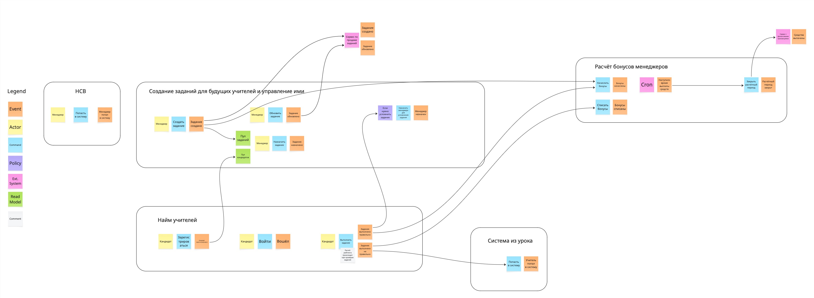
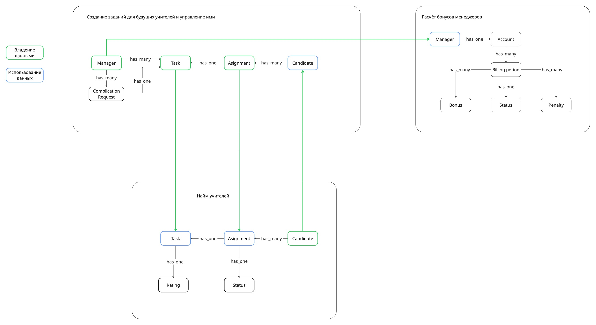
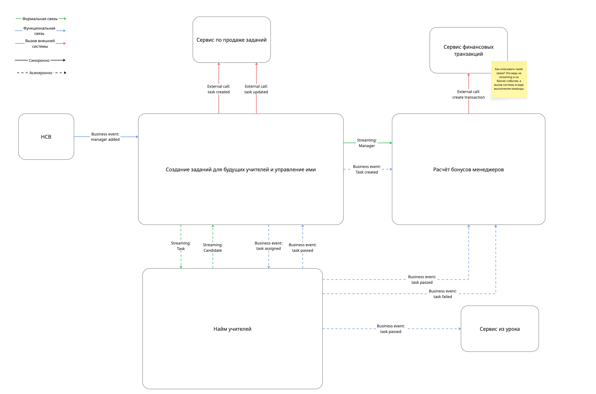

Домашняя работа N2
==================

Event storming
-----------------

[Ссылка на jpg](event-storming.jpg)

Концептуальная модель данных
-----------------

[Ссылка на jpg](data-model.jpg)

Общая модель формальных и функциональных связей
-----------------

[Ссылка на jpg](formal-and-functional.jpg)

Изменения коммуникаций
-----------------

|Номер связи|Как связь сделана на текущий момент|Какая теперь будет связь|Номера проблем бизнеса, которые потенциально решатся|Почему связь необходимо изменить|
|-----------|--------------|-----------------|----------------------------|-----------------------|
|[COMM-010]|HTTP-вызов| удалится | Problem-090,060 | В сервисе найма не нужна информация о менеджере |
|[COMM-020]|HTTP-вызов| асинхронное событие | Problem-080 | увеличит отказоустойчивость сервиса выполнения заданий|
|[COMM-030]|HTTP-вызов| асинхронное событие | Problem-010,050,070,080,090,100 | увеличит отказоустойчивость и уменьшит связанность |
|[COMM-040]|HTTP-вызов| асинхронное событие | Problem-010,040,050,080,090,100 | увеличит отказоустойчивость и уменьшит связанность |
|[COMM-050]|HTTP-вызов| асинхронное событие | Problem-010,040,050,070,080,090,100 | увеличит отказоустойчивость и уменьшит связанность |
|[COMM-060]| асинхронное событие | удалится | Problem-030,090 | рейтинг будет отправлен вместе с событием о выполнении задания, чтобы исключить гонку при начислении бонусов |
|[COMM-070]| HTTP-вызов | не изменится || нужна консистентность данных о менеджерах в двух системах|
|[COMM-080]| HTTP-вызов | асинхронное событие | Problem-080,090 | увеличит отказоустойчивость сервиса управления заданиями, упавший сервис бонусов не повлияет на его работу|
|[COMM-090]| HTTP-вызов | асинхронное событие | Problem-090 | увеличит отказоустойчивость и уменьшит связанность |

Топики и события
-----------------

| Название топика |Названия событий и номеров связи, которые окажутся в топике|Почему вы поместили в топик именно эти события|Почему так назвали|
|-----------|--------------|-----------------|----------------------------|
| data_replication.task |[COMM-020, COMM-050] data_replication.task.created, data_replication.task.updated | события относятся к жизненному циклу задачи | топик нужен для репликации задач |
| data_replication.candidate |[COMM-090] data_replication.candidate.created, data_replication.candidate.updated | события об изменении данных кандидата в учителя | топик нужен для репликации кандидатов |
| domain.candidate_testing | [COMM-030, COMM-040, COMM-050] domain.candidate_testing.task_passed, domain.candidate_testing.task_failed | Поместил в один топик, чтобы не усложнять роутинг. Если будет проблема из-за большого количества событий task_failed, который используются только в одном сервисе, то можно будет выделить в отдельный топик. | Бизнес-события прохождения тестов кандидатами |
| domain.task_management.assignment | [COMM-090] domain.task_management.assignment.task_assigned |  | Бизнес событие назначения заданий |
